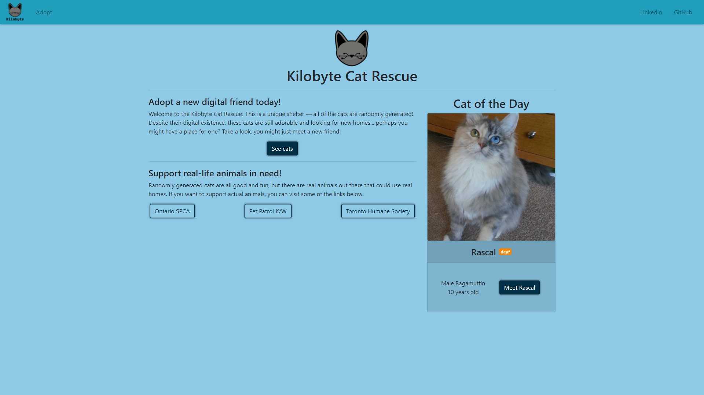
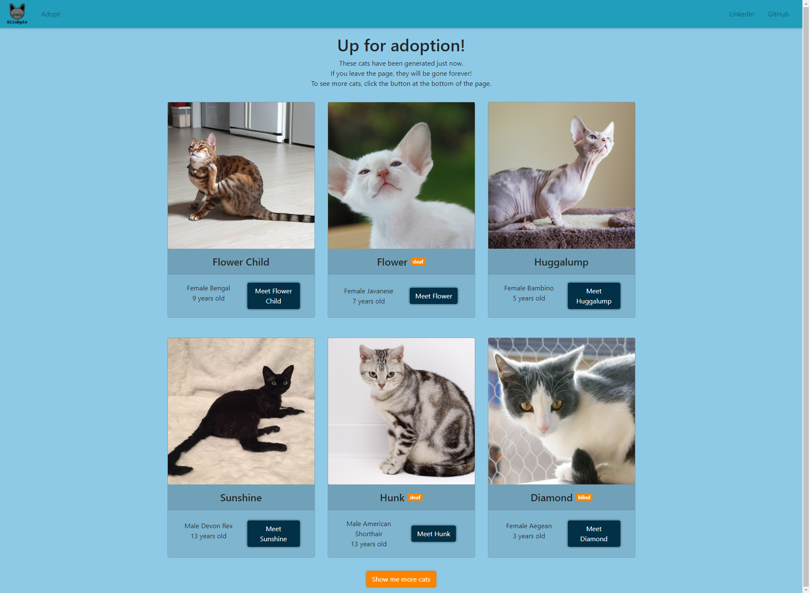
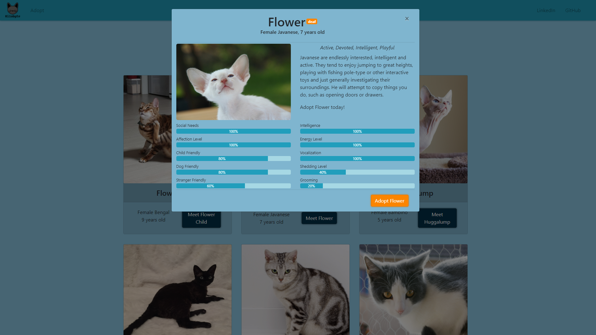

# The Kilobyte Cat Rescue
Welcome to the Kilobyte Cat Rescue! This is a unique shelter — all of the cats are randomly generated! Despite their digital existence, these cats are still adorable and looking for new homes... perhaps you might have a place for one? Take a look, you might just meet a new fictional friend!

## Preview

## Goals
Here are my learning goals for this project.
- Learn about React Hooks
- Get a better understanding of `react-bootstrap`
- Get a better understanding of `async`/`await`
- Use `react-loading-skeleton`

## Sources
Cat names list from:
- [sindresorhus/cat-names](https://github.com/sindresorhus/cat-names)
- [fregante/pet-names](https://github.com/fregante/pet-names)

Not all names from each list are included.

Cat images and breed information from:
[The Cat API](https://thecatapi.com/)

